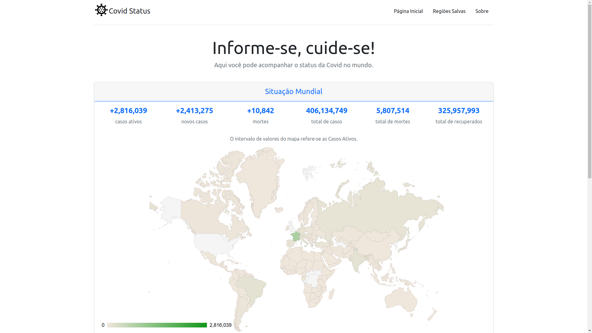

# Covid Status

Covid Status tem o intuito de apresentar a situação mundial da Covid.

 

## Demo

Acesse a demo [https://covid-status-six.vercel.app](https://covid-status-six.vercel.app)

## Integração

A fonte de dados é o Dataflow Kit API, para mais informações acesse: [https://covid-19.dataflowkit.com](https://covid-19.dataflowkit.com)

## Funcionalidades

- Consulta dos status de todas as regiões disponíveis na API;
- Possibilidade de salvar um "screenshot" das informações de cada região;
  - O armazenamento é feito no localStorage e o usuário pode analisar os itens salvos através de um gráfico.
  - Não é possível salvar uma região já salva que possua a mesma data de atualização, para evitar redundância na análise.
- Exclusão das informações salvas.

## 🤝 Colaboradores

<table>
  <tr>
    <td align="center">
      <a href="#">
         
        
          <b>Paulo de Lima Xavier </b>
        
         
        
          <b>20190104147</b>
        
      </a>
    </td>
  </tr>
</table>

#### Obrigado por chegar até aqui! ❤️  